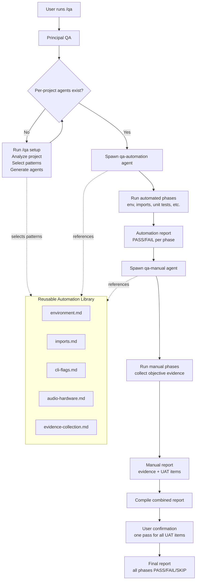

# Three-Layer QA System

A scalable QA framework for Claude Code projects with clear separation of concerns.

## Architecture

```
Layer 1: Principal QA (Global)
  ~/.claude/skills/qa/SKILL.md

Layer 2: Reusable Automation Library (Global)
  ~/.claude/skills/qa/automations/
    ├── environment.md
    ├── imports.md
    ├── cli-flags.md
    ├── audio-hardware.md
    └── evidence-collection.md

Layer 3: Per-Project Agents
  <project>/.claude/agents/
    ├── qa-automation.md   (automated tests)
    └── qa-manual.md       (manual/UAT tests)
```

### How the layers interact

- **Principal QA** is the orchestrator. It spawns per-project agents, collects reports, and presents results.
- **Automation Library** contains reusable test patterns. Per-project agents reference these patterns.
- **Per-Project Agents** contain project-specific test cases. They are generated by `/qa setup` and customized per project.

## Slash Commands

| Command | Description |
|---------|-------------|
| `/qa` | Full QA run (automation + manual) |
| `/qa setup` | Scaffold QA agents for current project |
| `/qa automation` | Run only automated tests (no human needed) |
| `/qa manual` or `/qa-manual` | Run only manual/UAT tests |
| `/qa library` | List available reusable automations |
| `/qa-setup` | Shortcut for `/qa setup` |

## Quick Start

### First time setup (any project)
```
cd /path/to/your/project
/qa setup
```
This analyzes your project and generates:
- `.claude/agents/qa-automation.md` -- automated test cases
- `.claude/agents/qa-manual.md` -- manual/UAT test cases

Review the generated agents and customize as needed.

### Running QA
```
/qa                 # Full run (automation + manual)
/qa automation      # Automated tests only (no human needed)
/qa-manual          # Manual/UAT tests only (needs you present)
/qa library         # See available reusable test patterns
```

### What happens when you run `/qa`
1. Principal QA spawns the **automation agent** -- runs all automated checks
2. Principal QA spawns the **manual agent** -- plays sounds, records mic, collects evidence
3. Both agents return reports
4. Principal QA shows you ONE confirmation prompt for UAT items
5. You confirm, QA is done

### Adding QA to a new project
1. `cd` into the project
2. Run `/qa setup` -- it reads your code and generates project-specific QA agents
3. Run `/qa` to execute

## Execution Flow



## Reusable Automation Library

| Pattern | File | Description | Applies To |
|---------|------|-------------|------------|
| Environment | `environment.md` | Python version, pip deps, external services | All Python projects |
| Imports | `imports.md` | Package import validation, public API surface | Projects with packages |
| CLI Flags | `cli-flags.md` | `--help` exits 0, expected flags present | Projects with CLI |
| Audio Hardware | `audio-hardware.md` | Mic signal, TTS playback, STT, wake word | Audio/hardware projects |
| Evidence Collection | `evidence-collection.md` | Structured evidence gathering, report template | All projects |

Library location: `~/.claude/skills/qa/automations/`

The library grows over time as new patterns are discovered during QA runs.

## Per-Project Agent Structure

### qa-automation.md (automated, no human needed)
- Environment & prerequisites checks
- Package import validation
- Unit-level logic tests
- Dry-run pipeline verification
- CI-reproducible (can run headless)

### qa-manual.md (requires human presence)
- Audio playback verification
- Voice input / STT testing
- iTerm2 integration
- Wake word detection
- Integration tests (start.sh)
- Hardware notes and device configuration
- Voice prompt instructions (`say -v Samantha`)

### Report format
Both agents produce structured reports with:
- Phase-by-phase PASS/FAIL/SKIP with evidence
- Manual agent includes "Items Requiring User Confirmation"
- Principal QA merges both into a single combined report

## Smart Terminal Narrator QA

This project's QA agents are at:
- `.claude/agents/qa-automation.md` -- Phases 1-4 (env, imports, unit tests, dry-run)
- `.claude/agents/qa-manual.md` -- Phases 5-9 (audio, voice, iTerm2, wake word, start.sh)
- `.claude/agents/qa.md` -- Legacy redirect (preserved for reference)
